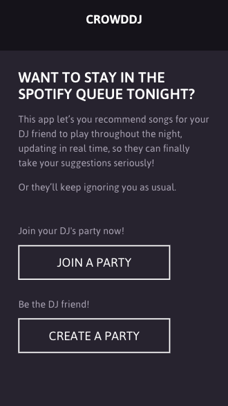
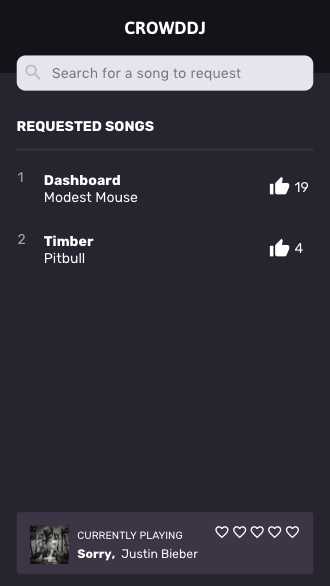
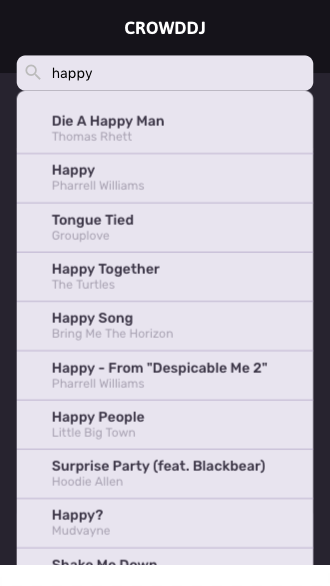
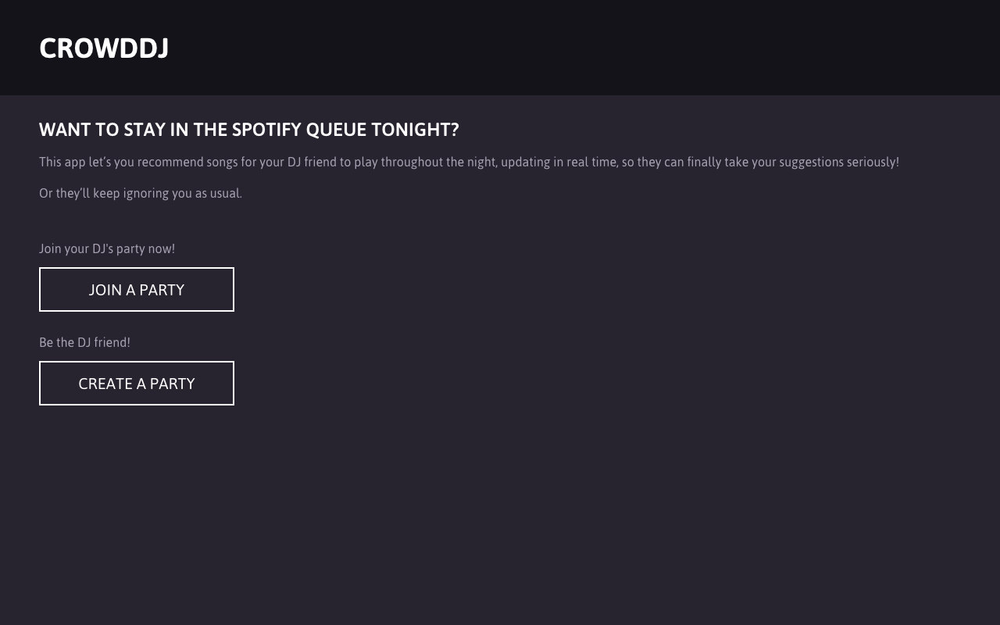
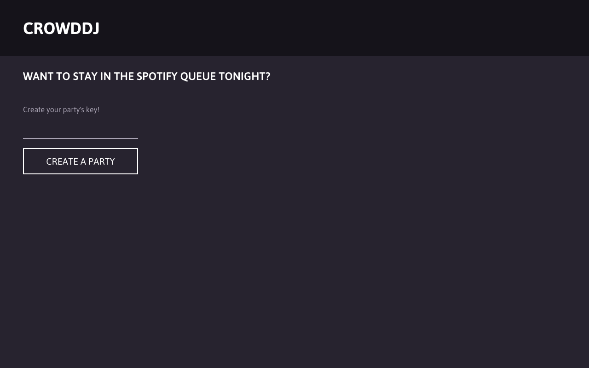
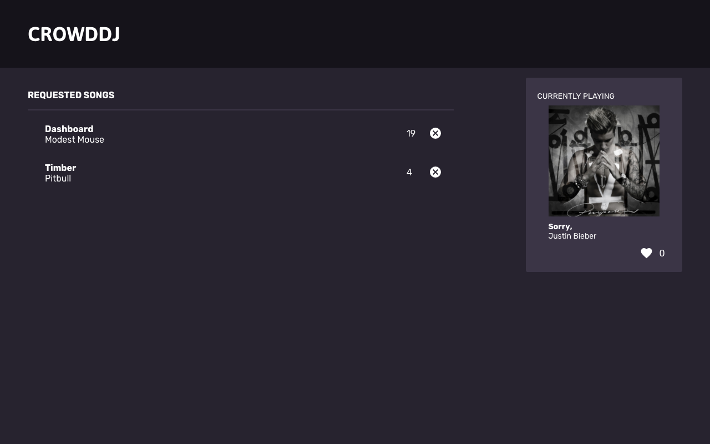

# Crowd DJ
- ReactJS
- Sass
- Firebase
  * We use Firebase to keep track of all our "Rooms" it holds our currently playing songs the average ratings of the songs as well as the suggested songs from out party listeners.
- Spotify API
  * Unfortunately Spotify's API does not support many useful feature like 'Get Song Queue' or 'Currently Playing'. In order to circumvent this problem we built Chrome Web Extension that scrapes the Spotify Web Player and uploads the relevant track data to our Firebase database. The Spotify API was primarily used for our live song search suggestions.

### Screenshots

